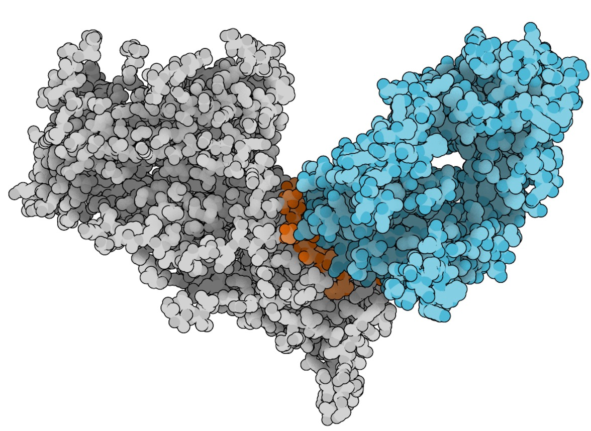

# PREDICTION OF EPITOPES USING ALPHAFOLD2 STRUCTURES AND GRAPH NEURAL NETWORKS
>#### Magnus H. Høie (s216559), Frederik S. Gade (s184260), Ida Meitil (s153020)
> Epitopes are surface-exposed regions of a pathogenic molecule or antigen, which are targeted by the adaptive immune system by e.g. B-cell receptors. Binding is largely determined by the surface features of the target molecule. AlphaFold2 is a deep-learning protein folding model achieving near experimental quality prediction for many proteins. Furthermore, graph-based neural networks such as ProteinSolver allow structural representation of proteins suitable for tasks such as epitope prediction. We investigate improved epitope prediction using Alphafold2 modelled structures over sequence-only models.
>
>*02456 DEEP LEARNING, DTU COMPUTE, FALL 2021*

<!-- PROJECT LOGO -->
<p align="center">
  <a href="https://github.com/FSGade/alphafold_epitopes">
    
  </a>
  <p align="center">
    Figure 1: Neutralizing antibody (cyan) bound to the epitope region (orange) of an HIV glycoprotein antigen (grey).</a>
  </p>
</p>
<br>

The main notebook of this project, [Epitope_Prediction.ipynb](https://github.com/FSGade/alphafold_epitopes/blob/main/Epitope_Prediction.ipynb), contains demonstrations of our three models (FFNN, RNN & GNN) and two reference models (Discotope2 [[1]](#1) and BepiPred3 [[2]](#2)) and a comparison of their performance. We allow use of both solved structure embeddings and AlphaFold2 [[3]](#2) structure embeddings. Both of these embeddings are made with ProteinSolver [[4]](#2).

Running this notebook requires specific versions of PyTorch and associated packages to be compatible with ProteinSolver. Using anaconda, the following commands should suffice to setup the correct environment:
```
conda env create -f PS_gpu.yaml
conda activate PS_gpu
conda install nb_conda
```
*Note that installing* `nb_conda` *makes it possible to use the conda environment in jupyter*

## References
<a id="1">[1]</a> 
Kringelum, J. V., Lundegaard, C., Lund, O., & Nielsen, M. (2012). Reliable B Cell Epitope Predictions: Impacts of Method Development and Improved Benchmarking.  PLoSComputationalBiology, 8(12). https://doi.org/10.1371/journal.pcbi.1002829

<a id="2">[2]</a> 
Jespersen, M. C., Peters, B., Nielsen, M., & Marcatili, P. (2017). BepiPred-2.0: Improving sequence-based B-cell epitope prediction using conformational epitopes.  NucleicAcidsResearch, 45(W1), W24–W29. https://doi.org/10.1093/nar/gkx346

<a id="3">[3]</a> 
Jumper, J et al (2021). Highly accurate protein structure prediction with AlphaFold. Nature, May, 1–12. https://doi.org/10.1038/s41586-021-03819-2

<a id="4">[4]</a> 
Strokach, A., Becerra, D., Corbi-Verge, C., Perez-Riba, A., & Kim, P. M. (2020). Fast and Flexible Protein Design Using Deep Graph Neural Networks. Cell Systems, 11(4), 402-411.e4. https://doi.org/10.1016/j.cels.2020.08.016
